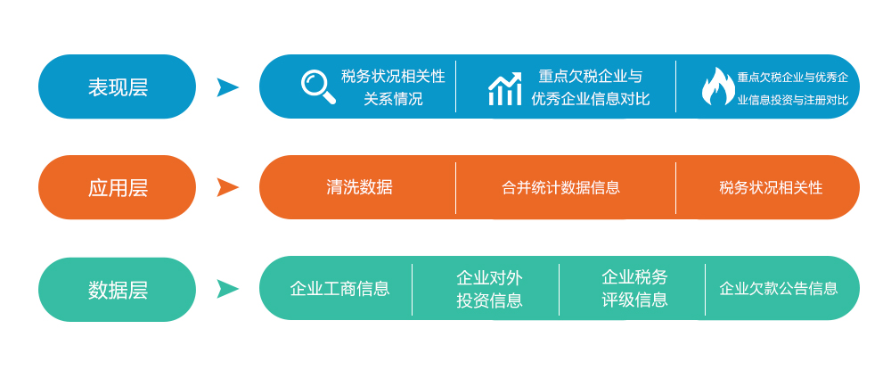

# 004-企业税务状况相关性分析案例

# 一、案例简介

## 1.1 1. 案例背景

随着现阶段市场经济的发展越来越走向正轨，对各行各业也提出了更高的要求。税务管理作为企业管理中十分重要的部分，历来都是人们关注的重点。对一般企业而言，想要在激烈的竞争中立于不败之地，就要对企业进行有力的税务管理。

计算机网络技术的不断普及是大数据时代到来的基础。大数据时代的到来，为企业进行全面精确的数据分析提供了平台，同时也给企业的数据筛选和数据处理能力带来了更大的挑战。企业在运营过程中会产生大量的数据信息，通过对数据信息的分析，可以有效地获取企业的经营成果、资产的负债状况和基金的经营风险。目前，传统的财务管理模式已经不能满足企业的发展需要。企业的财务管理创新迫在眉睫。研究大数据时代下财务管理所受的影响，对企业税收管理问题进行分析，并提出在大数据领域内的一些解决方案，为企业的金融发展奠定基础将是未来我们要研究的重要方向。

## 1.2 2. 案例意义

由于税务管理在我国出现的历史很短，尽管目前有关税务管理的专著已不少见，但整体上系统地对税务管理的理论和务实的探讨还比较缺乏，税务管理的研究在我国尚属一个新课题，有待于我们进一步的加强理论和实践的探索。但是税务管理正开始悄悄地进入人们的生活，企业的税务筹划欲望不断增强，筹划意识也在提高。

随着经济高速发展，国家对企业税收越来越重视，税收是国家长期稳定发展的一项重要指标。同时企业对税收成本越来越重视，希望通过税收筹划的手段达到企业税收负担的最小化，从而减轻资金压力，降低成本，增加经济效益。实际上，税收贯穿于企业经营活动的全过程，在经营中依据税收固定征收的特征，分析税务规律，将税务管理纳入企业成本的管理当中，作为企业有机管理的组成部分，为减轻税负进行有效的税务筹划，成为了企业进行科学管理的一种必然选择，是企业财务管理不可获取的重要内容。同时，互联网大数据时代的迅速发展，企业经营状况中产生的数据越来越被计算机充分地精准的捕捉，这使得企业拥有并不断增加这大量的有关于企业内部有价值的数据。而通过大数据技术对企业的财务管理数据进行分析，从而分析税务管理进而进行税务筹划，成为了企业税务管理新时代的重要支柱，是当今及未来企业税务管理、税务筹划的重要方向和手段。

## 1.3 3. 业务图

## 1.4 4. 案例目标

通过大数据技术对企业各项经营要素产生的数据的研究，分析这些经营数据与税务数据的相关性，找到企业各项经营指标与税务管理中的平衡关系和内在规律，对税务进行预测、评估、规避和化解,建立健全一整套规范、完整的税务风险管理防控体系。从而做出针对税务管理相关的规划的企业经营科学、合理的方针政策。帮助企业可持续发展、健康运营，为企业在行业中利于不败之地奠定坚实的基础。

# 二、相关技术

## 2.1 数据采集，通过pymysql连接mysql数据库获取数据

## 2.2 数据预处理，通过pandas进行数据清洗，转换等预处理

## 2.3 数据探索，通过matplotlib及pyecharts进行数据可视化，发现数据规律

# 三、案例步骤

## 3.1 1. 数据采集: 

从数据库casepro中获取数据表business_info\invest_abroad\owing_tax_info\tax_level,将表格转存在本地csv并展示数据

### 3.1.1 ① business_info 数据采集
### 3.1.2 ② invest_abroad 数据采集
### 3.1.3 ③ owing_tax_info 数据采集
### 3.1.4 ④ tax_level 数据采集

## 3.2 2、数据清洗
空数据判断和处理（注意分析空占比，区分数值型和类别型）
数据规范性检查（格式、范围等）
去除不规范数据、无效、无分析价值数据等

### 3.2.1 ① business_info 数据处理
### 3.2.2 ② invest_abroad 数据处理
### 3.2.3 ③ owing_tax_info 数据处理
### 3.2.4 ④ tax_level 数据处理

## 3.3 3、数据处理

将清洗后得到的企业工商信息、企业对外投资信息、企业税务评级信息、企业欠款公告信息

## 3.4 4、基础属性图表展示

### 3.3.1 business_info 基础数据展示
### 3.3.2 invest_abroad 基础数据展示
### 3.3.3 owing_tax_info 基础数据展示
### 3.3.4 tax_level 基础数据展示

## 3.5 5、合并多表

将相同企业的字段数据合并并统计在一行。

## 3.6 6、数据探索与分析

税务状况与相关字段数据之间的相关性关系
探索性可视化并给出分析结论
